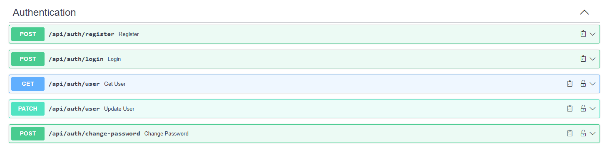

# ***Testowanie i jakość oprogramowania***
 

## Wykonanie: **Michał Polak**

### Temat projektu: **Implementacja testów w aplikacji internetowej z quizami**

## Opis projektu

Celem projektu było stworzenie prostej aplikacji internetowej z quizami, umożliwiającej dodawanie, generowanie oraz rozwiązywanie quizów. Projekt zawiera również testy potwierdzające poprawność działania aplikacji.

Aplikacja została wyposażona w podstawowe funkcjonalności, takie jak rejestracja, logowanie oraz autoryzacja użytkownika za pomocą tokena JWT. Po zalogowaniu użytkownik ma możliwość: aktualizacji danych profilowych, zmiany hasła, wylogowania się. Kluczowym elementem projektu było stworzenie funkcjonalności quizów. Quizy są dostępne na stronach `/home` oraz `/quizzes`, gdzie zalogowany użytkownik może przeglądać zarówno quizy publiczne, jak i swoje własne. Kolejną istotną funkcjonalnością jest tworzenie quizów. Użytkownik może to zrobić na stronie `/quizzes/wizard` poprzez wypełnienie prostego formularza. Formularz ten umożliwia również automatyczne generowanie quizów za pomocą sztucznej inteligencji, dzięki integracji z API OpenAI. Stworzony quiz można w dowolnym momencie edytować, co odbywa się w tym samym kreatorze, w którym quiz został utworzony. Podczas przeglądania dostępnych quizów użytkownik może wybrać interesujący go quiz i przejść do jego rozwiązywania. Po zakończeniu quizu aplikacja wyświetla podsumowanie wyniku, a użytkownik może: ponownie uruchomić quiz, wrócić do strony głównej oraz ocenić ukończony quiz.

W projekcie przeprowadzono szereg testów jednostkowych, integracyjnych oraz manualnych, które zostały omówione w kolejnych akapitach.

# Uruchomienie projektu

### ...

# Testy jednostowe i integracyjne

### Testy dotyczące użytkownika 

Lokalizacja: `/quizz-app-backend/src/quthentication/tests.py`

| ID tesu | Nazwa testu                                              | Krótki opis                                             | Typ testu         | Miejsce występowania                          |
| ------- | -------------------------------------------------------- | ------------------------------------------------------- | ----------------- | --------------------------------------------- |
| Test001 | test_register_success                                    | Test rejestracji z poprawnymi danymi                    | Test integracyjny | klasa: TestRegistrationEndpoint (linia 17)    |
| Test002 | test_register_with_duplicate_email                       | Test rejestracji z istniejącym adresem email            | Test jednostkowy  | klasa: TestRegistrationEndpoint (linia 38)    |
| Test003 | test_register_with_duplicate_username                    | Test rejestracji z istniejącą nazwą użytkownika         | Test jednostkowy  | klasa: TestRegistrationEndpoint (linia 58)    |
| Test004 | test_register_with_password_mismatch                     | Test rejestracji z niezgodnym potwierdzeniem hasła      | Test jednostkowy  | klasa: TestRegistrationEndpoint (linia 78)    |
| Test005 | test_register_with_invalid_email_format                  | Test rejestracji z brakiem @ w emailu                   | Test jednostkowy  | klasa: TestRegistrationEndpoint (linia 98)    |
| Test006 | test_register_invalid_email_missing_period_in_domain     | Test rejestracji z brakującą kropką w domenie emaila    | Test jednostkowy  | klasa: TestRegistrationEndpoint (linia 118)   |
| Test007 | test_register_invalid_password_missing_uppercase_letter  | Test hasła bez wielkiej litery                          | Test jednostkowy  | klasa: TestRegistrationEndpoint (linia 138)   |
| Test008 | test_register_invalid_password_missing_lowercase_letter  | Test hasła bez małej litery                             | Test jednostkowy  | klasa: TestRegistrationEndpoint (linia 158)   |
| Test009 | test_register_invalid_password_missing_digit             | Test hasła bez cyfry                                    | Test jednostkowy  | klasa: TestRegistrationEndpoint (linia 178)   |
| Test010 | test_register_invalid_password_missing_special_character | Test hasła bez znaku specjalnego                        | Test jednostkowy  | klasa: TestRegistrationEndpoint (linia 198)   |
| Test011 | test_register_invalid_password_too_short                 | Test hasła krótszego niż 8 znaków                       | Test jednostkowy  | klasa: TestRegistrationEndpoint (linia 218)   |
| Test012 | test_login_success                                       | Test logowania z poprawnymi danymi                      | Test integracyjny | klasa: TestLoginEndpoint (linia 247)          |
| Test013 | test_login_invalid_email                                 | Test logowania z niepoprawnym adresem email             | Test jednostkowy  | klasa: TestLoginEndpoint (linia 267)          |
| Test014 | test_login_invalid_password                              | Test logowania z niepoprawnym hasłem                    | Test jednostkowy  | klasa: TestLoginEndpoint (linia 285)          |
| Test015 | test_login_user_not_active                               | Test logowania dla nieistniejącego użytkownika          | Test jednostkowy  | klasa: TestLoginEndpoint (linia 303)          |
| Test016 | test_login_missing_email_field                           | Test logowania z brakującym polem email                 | Test jednostkowy  | klasa: TestLoginEndpoint (linia 323)          |
| Test017 | test_login_missing_password_field                        | Test logowania z brakującym polem hasła                 | Test jednostkowy  | klasa: TestLoginEndpoint (linia 341)          |
| Test018 | test_get_user_success                                    | Test pobierania danych uwierzytelnionego użytkownika    | Test integracyjny | klasa: TestUserEndpoints (linia 378)          |
| Test019 | test_get_user_without_token                              | Test pobierania danych użytkownika bez tokenu           | Test jednostkowy  | klasa: TestUserEndpoints (linia 394)          |
| Test020 | test_update_user_success                                 | Test aktualizacji danych użytkownika                    | Test integracyjny | klasa: TestUserEndpoints (linia 406)          |
| Test021 | test_update_user_without_token                           | Test aktualizacji danych użytkownika bez tokenu         | Test jednostkowy  | klasa: TestUserEndpoints (linia 426)          |
| Test022 | test_update_user_with_duplicate_username                 | Test aktualizacji danych z istniejącą nazwą użytkownika | Test jednostkowy  | klasa: TestUserEndpoints (linia 444)          |
| Test023 | test_update_user_with_duplicate_email                    | Test aktualizacji danych z istniejącym adresem email    | Test jednostkowy  | klasa: TestUserEndpoints (linia 462)          |
| Test024 | test_change_password_success                             | Test poprawnej zmiany hasła                             | Test integracyjny | klasa: TestChangePasswordEndpoint (linia 494) |
| Test025 | test_change_password_wrong_old_password                  | Test zmiany hasła z błędnym starym hasłem               | Test jednostkowy  | klasa: TestChangePasswordEndpoint (linia 516) |
| Test026 | test_change_password_mismatched_new_passwords            | Test zmiany hasła z niezgodnymi nowymi hasłami          | Test jednostkowy  | klasa: TestChangePasswordEndpoint (linia 536) |
| Test027 | test_change_password_invalid_new_password                | Test zmiany hasła na niepoprawne nowe hasło             | Test jednostkowy  | klasa: TestChangePasswordEndpoint (linia 555) |
| Test028 | test_change_password_without_token                       | Test zmiany hasła bez tokenu                            | Test jednostkowy  | klasa: TestChangePasswordEndpoint (linia 573) |
 

### Testy dotyczące quizu 

Lokalizacja: `/quizz-app-backend/src/quiz/tests.py`

| ID tesu | Nazwa testu                               | Krótki opis                                                           | Typ testu         | Miejsce występowania                        |
| ------- | ----------------------------------------- | --------------------------------------------------------------------- | ----------------- | ------------------------------------------- |
| Test029 | test_create_quiz_success                  | Test poprawnego tworzenia quizu                                       | Test integracyjny | klasa: TestCreateQuizEndpoint (linia 27)    |
| Test030 | test_create_quiz_without_authentication   | Test tworzenia quizu bez podania tokena uwierzytelniającego           | Test jednostkowy  | klasa: TestCreateQuizEndpoint (linia 74)    |
| Test031 | test_create_quiz_missing_required_fields  | Test tworzenia quizu z z brakującymi wymaganymi polami                | Test jednostkowy  | klasa: TestCreateQuizEndpoint (linia 103)   |
| Test032 | test_create_quiz_invalid_category         | Test tworzenia quizu z nieprawidłową kategorią                        | Test jednostkowy  | klasa: TestCreateQuizEndpoint (linia 125)   |
| Test033 | test_create_quiz_invalid_question         | Test tworzenia quizu z nieprawidłowym schematem pytania               | Test jednostkowy  | klasa: TestCreateQuizEndpoint (linia 157)   |
| Test034 | test_create_quiz_invalid_options          | Test tworzenia quizu z nieprawidłowym schematem odpowiedzi            | Test jednostkowy  | klasa: TestCreateQuizEndpoint (linia 189)   |
| Test035 | test_generate_quiz_success                | Test poprawnego wygenerowania quizu                                   | Test integracyjny | klasa: TestGenerateQuizEndpoint (linia 236) |
| Test036 | test_generate_quiz_without_authentication | Test generowania quizu bez podania tokena uwierzytelniającego         | Test jednsotkowy  | klasa: TestGenerateQuizEndpoint (linia 258) |
| Test037 | test_get_all_public_quizzes               | Test poprawnego pobierania wszystkich quizów                          | Test integracyjny | klasa: TestGetQuizzesEndpoint (linia 299)   |
| Test038 | test_get_quizzes_with_filter_my           | Test poprawnego pobierania quizów stworzonych przez użytkownika       | Test integracyjny | klasa: TestGetQuizzesEndpoint (linia 316)   |
| Test039 | test_get_quizzes_with_filter_latest       | Test poprawnego pobierania najnowszych quizów                         | Test integracyjny | klasa: TestGetQuizzesEndpoint (linia 331)   |
| Test040 | test_get_quizzes_with_filter_latest       | Test poprawnego pobierania najwyżej ocenianych quizów                 | Test integracyjny | klasa: TestGetQuizzesEndpoint (linia 346)   |
| Test041 | test_get_quizzes_with_filter_most_popular | Test poprawnego pobierania najpopularniejszych quizów                 | Test integracyjny | klasa: TestGetQuizzesEndpoint (linia 361)   |
| Test042 | test_get_quizzes_with_wrong_filter        | Test pobierania quizów z nieistniejącym filtrem                       | Test jednostkowy  | klasa: TestGetQuizzesEndpoint (linia 276)   |
| Test043 | test_get_quiz_detail_success              | Test poprawnego pobierania quizu o określonym ID                      | Test integracyjny | klasa: TestQuizDetailEndpoint (linia 421)   |
| Test044 | test_get_quiz_detail_non_exist            | Test pobierania quizu o nieistniejącym ID                             | Test jednostkowy  | klasa: TestQuizDetailEndpoint (linia 435)   |
| Test045 | test_get_quiz_detail_without_token        | Test pobierania quizu bez podania tokena uwierzytelniającego          | Test jednostkowy  | klasa: TestQuizDetailEndpoint (linia 450)   |
| Test046 | test_update_quiz_success                  | Test poprawnej aktualizacji swojego quizu                             | Test integracyjny | klasa: TestQuizDetailEndpoint (linia 465)   |
| Test047 | test_update_quiz_non_author               | Test aktualizacji nieswojego quizu                                    | Test jednostkowy  | klasa: TestQuizDetailEndpoint (linia 489)   |
| Test048 | test_submit_quiz_success_first_time       | Test poprawnego przesłania wyniku quizu                               | Test integracyjny | klasa: TestSubmitQuizEndpoint (linia 533)   |
| Test049 | test_submit_quiz_with_higher_score        | Test aktualizacji wyniku quizu na lepszy                              | Test integracyjny | klasa: TestSubmitQuizEndpoint (linia 557)   |
| Test050 | test_submit_quiz_with_lower_score         | Test aktualizacji wyniku quizu na gorszy                              | Test integracyjny | klasa: TestSubmitQuizEndpoint (linia 585)   |
| Test051 | test_submit_quiz_without_authentication   | Test przesyłania wyniku quizu bez podania tokena uwierzytelniającego  | Test jednostokwy  | klasa: TestSubmitQuizEndpoint (linia 609)   |
| Test052 | test_submit_quiz_invalid_quiz_id          | Test aktualizacji wyniku z nieistniejącym ID                          | Test jednostokwy  | klasa: TestSubmitQuizEndpoint (linia 626)   |
| Test053 | test_submit_quiz_with_invalid_payload     | Test aktualizacji wyniku z nieodpowiednim przesłanym schematem danych | Test jednostokwy  | klasa: TestSubmitQuizEndpoint (linia 645)   |
 

# Dokumentacja API

Dokumentacja znajduje się na Swagger w wersji trial, więc nie wiadomo czy będzie jeszcze aktywna.
https://app.swaggerhub.com/apis/POLAKMICHAL3008_1/QuizzApp/1.0.0

Po uruchomieniu projektu dokumentacja zanjduje się pod adresem:
http://127.0.0.1:8000/api/docs# 

Przedstawienie graficzne: 

# Przypadki testowe dla testera manualnego

### ***Testy rejestracji***

| **ID testu**            | Test001                                                                                                                                                                                                                                                                                                   |
| ----------------------- | --------------------------------------------------------------------------------------------------------------------------------------------------------------------------------------------------------------------------------------------------------------------------------------------------------- |
| **Tytuł**               | ***Rejestracja użytkownika z poprawnymi danymi.***                                                                                                                                                                                                                                                        |
| **Warunki początkowe**  | Aplikacja ***QuizzApp*** jest otwarta na stronie rejestracji `/register`.                                                                                                                                                                                                                                 |
| **Kroki testowe**       | 1. Wprowadź unikatową nazwę użytkownika. 2. Wprowadź niezarejestrowany, poprawny adres email. 3. Wprowadź poprawne hasło spełniające wszystkie wymagane kryteria (8 znaków, mała litera, duża litera, liczba, znak specjalny). 4. Powtórz poprawnie hasło. 5. Kliknij przycisk *Załóż konto*. |
| **Oczekiwany rezultat** | Wyświetlenie komunikatu ***Rejestracja powiodła się. Witamy!*** i przeniesienie na stronę logowania `/login`.                                                                                                                                                                                             |
 

| **ID testu**            | Test002                                                                                                                                                                                                                                                                                                |
| ----------------------- | ------------------------------------------------------------------------------------------------------------------------------------------------------------------------------------------------------------------------------------------------------------------------------------------------------ |
| **Tytuł**               | ***Rejestracja użytkownika ze zduplikownym adresem email.***                                                                                                                                                                                                                                           |
| **Warunki początkowe**  | Aplikacja ***QuizzApp*** jest otwarta na stronie rejestracji `/register`.                                                                                                                                                                                                                              |
| **Kroki testowe**       | 1. Wprowadź unikatową nazwę użytkownika. 2. Wprowadź zarejestrowany, poprawny adres email. 3. Wprowadź poprawne hasło spełniające wszystkie wymagane kryteria (8 znaków, mała litera, duża litera, liczba, znak specjalny). 4. Powtórz poprawnie hasło. 5. Kliknij przycisk *Załóż konto*. |
| **Oczekiwany rezultat** | Wyświetlenie komunikatu ***Podany adres email jest już używany.*** i pozostanie na stronie rejestracji.                                                                                                                                                                                                |
 

| **ID testu**            | Test003                                                                                                                                                                                                                                                                                                 |
| ----------------------- | ------------------------------------------------------------------------------------------------------------------------------------------------------------------------------------------------------------------------------------------------------------------------------------------------------- |
| **Tytuł**               | ***Rejestracja użytkownika ze zduplikowną nazwą użytkownika.***                                                                                                                                                                                                                                         |
| **Warunki początkowe**  | Aplikacja ***QuizzApp*** jest otwarta na stronie rejestracji `/register`.                                                                                                                                                                                                                               |
| **Kroki testowe**       | 1. Wprowadź używaną nazwę użytkownika. 2. Wprowadź niezarejestrowany, poprawny adres email. 3. Wprowadź poprawne hasło spełniające wszystkie wymagane kryteria (8 znaków, mała litera, duża litera, liczba, znak specjalny). 4. Powtórz poprawnie hasło. 5. Kliknij przycisk *Załóż konto*. |
| **Oczekiwany rezultat** | Wyświetlenie komunikatu ***Podana nazwa użytkownika jest już używana.*** i pozostanie na stronie rejestracji.                                                                                                                                                                                           |
 

### ***Testy logowania***

| **ID testu**            | Test004                                                                                                |
| ----------------------- | ------------------------------------------------------------------------------------------------------ |
| **Tytuł**               | ***Logowanie użytkownika z poprawnymi danymi.***                                                       |
| **Warunki początkowe**  | Aplikacja ***QuizzApp*** jest otwarta na stronie logowania `/login`.                                   |
| **Kroki testowe**       | 1. Wprowadź poprawny adres email. 2. Wprowadź poprawne hasło. 3. Kliknij przycisk "Zaloguj się". |
| **Oczekiwany rezultat** | Wyświetlenie komunikatu ***Pomyślnie zalogowano. Witamy!*** i przeniesienie na stronę domową `/home`.  |
 

| **ID testu**            | Test005                                                                                                                                                                    |
| ----------------------- | -------------------------------------------------------------------------------------------------------------------------------------------------------------------------- |
| **Tytuł**               | ***Logowanie użytkownika z niepoprawnym adresem email.***                                                                                                                  |
| **Warunki początkowe**  | Aplikacja ***QuizzApp*** jest otwarta na stronie logowania `/login`.                                                                                                       |
| **Kroki testowe**       | 1. Wprowadź niepoprawny adres email. 2. Wprowadź poprawne hasło. 3. Kliknij przycisk "Zaloguj się".                                                                  |
| **Oczekiwany rezultat** | Wyświetlenie komunikatu ***Podany adres email lub hasło są niepoprawne. Sprawdź poprawność wprowadzoanych danych i spróbuj ponownie.*** i pozostanie na stronie logowania. |
 

| **ID testu**            | Test006                                                                                                                                                                    |
| ----------------------- | -------------------------------------------------------------------------------------------------------------------------------------------------------------------------- |
| **Tytuł**               | ***Logowanie użytkownika z niepoprawnym hasłem***                                                                                                                          |
| **Warunki początkowe**  | Aplikacja ***QuizzApp*** jest otwarta na stronie logowania `/login`.                                                                                                       |
| **Kroki testowe**       | 1. Wprowadź poprawny adres email. 2. Wprowadź niepoprawne hasło. 3. Kliknij przycisk "Zaloguj się".                                                                  |
| **Oczekiwany rezultat** | Wyświetlenie komunikatu ***Podany adres email lub hasło są niepoprawne. Sprawdź poprawność wprowadzoanych danych i spróbuj ponownie.*** i pozostanie na stronie logowania. |
 

### ***Aktualizacja danych użytkownika***

| **ID testu**            | Test007                                                                                                                                                  |
| ----------------------- | -------------------------------------------------------------------------------------------------------------------------------------------------------- |
| **Tytuł**               | ***Aktualizacja danych użytkownika z poprawnymi danymi.***                                                                                               |
| **Warunki początkowe**  | Użytkownik jest zalogowany. Aplikacja ***QuizzApp*** jest otwarta na stronie ustawień profilowych `/profile` i wybrana jest zakładka `Zaktualizuj dane`. |
| **Kroki testowe**       | 1. Wprowadź nowy poprawny adres email lub nazwę użytkownika. 2. Kliknij przycisk "Zapisz zmiany".                                                     |
| **Oczekiwany rezultat** | Wyświetlenie komunikatu ***Dane użytkownika zostały pomyślnie zaktualizowane.*** i pozostanie na stronie ustawień profilowych.                           |
 

| **ID testu**            | Test008                                                                                                                                                  |
| ----------------------- | -------------------------------------------------------------------------------------------------------------------------------------------------------- |
| **Tytuł**               | ***Aktualizacja danych użytkownika ze zduplikownym adresem email***                                                                                      |
| **Warunki początkowe**  | Użytkownik jest zalogowany. Aplikacja ***QuizzApp*** jest otwarta na stronie ustawień profilowych `/profile` i wybrana jest zakładka `Zaktualizuj dane`. |
| **Kroki testowe**       | 1. Wprowadź używany adres email. 2. Kliknij przycisk "Zapisz zmiany".                                                                                 |
| **Oczekiwany rezultat** | Wyświetlenie komunikatu ***Podany adres email jest już używany.*** i pozostanie na stronie ustawień profilowych.                                         |
 

| **ID testu**            | Test009                                                                                                                                                  |
| ----------------------- | -------------------------------------------------------------------------------------------------------------------------------------------------------- |
| **Tytuł**               | ***Aktualizacja danych użytkownika ze zduplikowną nazwą użytkownika.***                                                                                  |  |
| **Warunki początkowe**  | Użytkownik jest zalogowany. Aplikacja ***QuizzApp*** jest otwarta na stronie ustawień profilowych `/profile` i wybrana jest zakładka `Zaktualizuj dane`. |
| **Kroki testowe**       | 1. Wprowadź używaną nazwę użytkownika. 2. Kliknij przycisk "Zapisz zmiany".                                                                           |
| **Oczekiwany rezultat** | Wyświetlenie komunikatu ***Podana nazwa użytkownika jest już używana.*** i pozostanie na stronie ustawień profilowych.                                   |
 

### ***Aktualizacja hasła***

| **ID testu**            | Test010                                                                                                                                                                                                                                               |
| ----------------------- | ----------------------------------------------------------------------------------------------------------------------------------------------------------------------------------------------------------------------------------------------------- |
| **Tytuł**               | ***Zmiana hasła z poprawnymi danymi.***                                                                                                                                                                                                               |
| **Warunki początkowe**  | Użytkownik jest zalogowany. Aplikacja ***QuizzApp*** jest otwarta na stronie ustawień profilowych `/profile` i wybrana jest zakładka `Zmień hasło`.                                                                                                   |
| **Kroki testowe**       | 1. Wprowadź poprawne obecne hasło. 2. Wprowadź poprawne nowe hasło spełniające wszystkie wymagane kryteria (8 znaków, mała litera, duża litera, liczba, znak specjalny). 3. Powtórz poprawnie nowe hasło. 4. Kliknij przycisk "Zmień hasło". |
| **Oczekiwany rezultat** | Wyświetlenie komunikatu ***Hasło zostało zmienione.*** i pozostanie na stronie zmiany hasła.                                                                                                                                                          |
 

| **ID testu**            | Test011                                                                                                                                                                                                                                                  |
| ----------------------- | -------------------------------------------------------------------------------------------------------------------------------------------------------------------------------------------------------------------------------------------------------- |
| **Tytuł**               | ***Zmiana hasła z niepoprawnym obecnym hasłem.***                                                                                                                                                                                                        |
| **Warunki początkowe**  | Użytkownik jest zalogowany. Aplikacja ***QuizzApp*** jest otwarta na stronie ustawień profilowych `/profile` i wybrana jest zakładka `Zmień hasło`.                                                                                                      |
| **Kroki testowe**       | 1. Wprowadź niepoprawne obecne hasło. 2. Wprowadź poprawne nowe hasło spełniające wszystkie wymagane kryteria (8 znaków, mała litera, duża litera, liczba, znak specjalny). 3. Powtórz poprawnie nowe hasło. 4. Kliknij przycisk "Zmień hasło". |
| **Oczekiwany rezultat** | Wyświetlenie komunikatu ***Obecne hasło, które podałeś jest niepoprawne.*** i pozostanie na stronie zmiany hasła.                                                                                                                                        |
 

| **ID testu**            | Test012                                                                                                                                                                                                                                                  |
| ----------------------- | -------------------------------------------------------------------------------------------------------------------------------------------------------------------------------------------------------------------------------------------------------- |
| **Tytuł**               | ***Zmiana hasła z różniącym się nowym hasłem.***                                                                                                                                                                                                         |
| **Warunki początkowe**  | Użytkownik jest zalogowany. Aplikacja ***QuizzApp*** jest otwarta na stronie ustawień profilowych `/profile` i wybrana jest zakładka `Zmień hasło`.                                                                                                      |
| **Kroki testowe**       | 1. Wprowadź poprawne obecne hasło. 2. Wprowadź poprawne nowe hasło spełniające wszystkie wymagane kryteria (8 znaków, mała litera, duża litera, liczba, znak specjalny). 3. Powtórz niepoprawnie nowe hasło. 4. Kliknij przycisk "Zmień hasło". |
| **Oczekiwany rezultat** | Wyświetlenie komunikatu ***Podane hasła różnią się od siebie!*** i pozostanie na stronie zmiany hasła.                                                                                                                                                   |
 

### ***Tworzenie quizu***

| **ID testu**            | Test013                                                                                                                                                                                                                                                                                                                                                                            |
| ----------------------- | ---------------------------------------------------------------------------------------------------------------------------------------------------------------------------------------------------------------------------------------------------------------------------------------------------------------------------------------------------------------------------------- |
| **Tytuł**               | ***Tworzenie quizu z poprawnymi danymi.***                                                                                                                                                                                                                                                                                                                                         |
| **Warunki początkowe**  | Użytkownik jest zalogowany. Aplikacja ***QuizzApp*** jest otwarta na stronie kreatora quizów `/quizzes/wizard`.                                                                                                                                                                                                                                                                    |
| **Kroki testowe**       | 1. Wprowadź poprawne unikalną nazwę quizu. 2. Wprowadź opis quizu. 3. Wybierz kategorię quizu. 4. Kliknij przycisk "Dodaj pytanie". 5. Dodaj 3 pytania 6. Wprowadź tekst pytań. 7. Dodaj do każdego pytania po co najmniej 3 odpowiedzi. 8. Wprowadź treść odpowiedzi. 9. Zaznacz jedną z odpowiedzi jako poprawną. 10. Kliknij przycisk "Stwórz quiz". |
| **Oczekiwany rezultat** | Wyświetlenie komunikatu ***Pomyślnie utworzono quiz. Miłej zabawy!*** i przeniesienie na stronę główną `/home`.                                                                                                                                                                                                                                                                    |
 

| **ID testu**            | Test014                                                                                                         |
| ----------------------- | --------------------------------------------------------------------------------------------------------------- |
| **Tytuł**               | ***Tworzenie quizu bez podania tematu.***                                                                       |
| **Warunki początkowe**  | Użytkownik jest zalogowany. Aplikacja ***QuizzApp*** jest otwarta na stronie kreatora quizów `/quizzes/wizard`. |
| **Kroki testowe**       | 1. Nie wprowadzaj nazwy quizu. 2. Kliknij przycisk "Stwórz quiz".                                            |
| **Oczekiwany rezultat** | Wyświetlenie komunikatu ***Podanie tematu quizu jest wymagane!*** i pozostanie na stronie kreatora quizów.      |
 

| **ID testu**            | Test015                                                                                                         |
| ----------------------- | --------------------------------------------------------------------------------------------------------------- |
| **Tytuł**               | ***Tworzenie quizu bez podania opisu.***                                                                        |
| **Warunki początkowe**  | Użytkownik jest zalogowany. Aplikacja ***QuizzApp*** jest otwarta na stronie kreatora quizów `/quizzes/wizard`. |
| **Kroki testowe**       | 1. Nie wprowadzaj opisu quizu. 2. Kliknij przycisk "Stwórz quiz".                                            |
| **Oczekiwany rezultat** | Wyświetlenie komunikatu ***Podanie opisu quizu jest wymagane!*** i pozostanie na stronie kreatora quizów.       |
 

| **ID testu**            | Test016                                                                                                         |
| ----------------------- | --------------------------------------------------------------------------------------------------------------- |
| **Tytuł**               | ***Tworzenie quizu bez wybrania kategorii***                                                                    |
| **Warunki początkowe**  | Użytkownik jest zalogowany. Aplikacja ***QuizzApp*** jest otwarta na stronie kreatora quizów `/quizzes/wizard`. |
| **Kroki testowe**       | 1. Nie wybieraj kategorii quizu. 2. Kliknij przycisk "Stwórz quiz".                                          |
| **Oczekiwany rezultat** | Wyświetlenie komunikatu ***Podanie kategorii quizu jest wymagane!*** i pozostanie na stronie kreatora quizów.   |
 

| **ID testu**            | Test017                                                                                                          |
| ----------------------- | ---------------------------------------------------------------------------------------------------------------- |
| **Tytuł**               | ***Tworzenie quizu bez podania pytań.***                                                                         |
| **Warunki początkowe**  | Użytkownik jest zalogowany. Aplikacja ***QuizzApp*** jest otwarta na stronie kreatora quizów `/quizzes/wizard`.  |
| **Kroki testowe**       | 1. Nie dodawaj pytań do quizu. 2. Kliknij przycisk "Stwórz quiz".                                             |
| **Oczekiwany rezultat** | Wyświetlenie komunikatu ***Quiz musi posiadać co najmniej 3 pytania!*** i pozostanie na stronie kreatora quizów. |
 

| **ID testu**            | Test018                                                                                                                                                          |
| ----------------------- | ---------------------------------------------------------------------------------------------------------------------------------------------------------------- |
| **Tytuł**               | ***Tworzenie quizu bez podania tematu pytania lub odpowiedzi***                                                                                                  |
| **Warunki początkowe**  | Użytkownik jest zalogowany. Aplikacja ***QuizzApp*** jest otwarta na stronie kreatora quizów `/quizzes/wizard`.                                                  |
| **Kroki testowe**       | 1. Nie dodawaj tematu pytania. 2. Nie dodawaj opdowiedzi do pytania.  3. Kliknij przycisk "Stwórz quiz".                                                   |
| **Oczekiwany rezultat** | Wyświetlenie komunikatu ***Każde pytanie wymaga podania tytułu oraz co najmniej 3 odpowiedzi w tym jednej poprawnej.*** i pozostanie na stronie kreatora quizów. |
 

| **ID testu**            | Test019                                                                                                                                                   |
| ----------------------- | --------------------------------------------------------------------------------------------------------------------------------------------------------- |
| **Tytuł**               | ***Publikacja quizu.***                                                                                                                                   |
| **Warunki początkowe**  | Użytkownik jest zalogowany. Aplikacja ***QuizzApp*** jest otwarta na stronie kreatora quizów `/quizzes/wizard`.                                           |
| **Kroki testowe**       | 1. Wprowadzamy poprawne dane quizu. 2. Kiknij w przełącznik koło napisu "Quiz Prywatny".  3. Kliknij przycisk "Stwórz quiz" lub "Zaktualizuj Quiz". |
| **Oczekiwany rezultat** | Wyświetlenie komunikatu ***Pomyślnie utworzono quiz. Miłej zabawy!***. Quiz jest widoczny dla wszystkich zalogowanych użytkowników.                       |
 

| **ID testu**            | Test020                                                                                                                                |
| ----------------------- | -------------------------------------------------------------------------------------------------------------------------------------- |
| **Tytuł**               | ***Usuwanie pytania z quizu.***                                                                                                        |
| **Warunki początkowe**  | Użytkownik jest zalogowany. Aplikacja ***QuizzApp*** jest otwarta na stronie kreatora quizów `/quizzes/wizard`. Dodane jest pytanie/a. |
| **Kroki testowe**       | 1. Wybranie pytania do usunięcia. 2. Kliknij w przycisk "Usuń pytanie pod pytaniem."                                             |
| **Oczekiwany rezultat** | Pytanie zostało usunięte.                                                                                                              |
 

### ***Generowanie quizu***

| **ID testu**            | Test021                                                                                                                                          |
| ----------------------- | ------------------------------------------------------------------------------------------------------------------------------------------------ |
| **Tytuł**               | ***Generowanie pytań i odpowiedzi do quizu.***                                                                                                   |
| **Warunki początkowe**  | Użytkownik jest zalogowany. Aplikacja ***QuizzApp*** jest otwarta na stronie kreatora quizów `/quizzes/wizard`.                                  |
| **Kroki testowe**       | 1. Wprowadź poprawne unikalną nazwę quizu. 2. Wprowadź opis quizu. 3. Wybierz kategorię quizu. 4. Kliknij przycisk "Wygeneruj pytania". |
| **Oczekiwany rezultat** | Wyświetlenie wygenerowanych pytań i odpowiedzi, które można edytować i kontynuować tworzenie quizu.                                              |
 

### ***Edycja quizu***

| **ID testu**            | Test022                                                                                                                        |
| ----------------------- | ------------------------------------------------------------------------------------------------------------------------------ |
| **Tytuł**               | ***Wyświetlenie edycji quizu.***                                                                                               |
| **Warunki początkowe**  | Użytkownik jest zalogowany. Aplikacja ***QuizzApp*** jest otwarta na stronie głównej `/home` lub stronie z quizami `/quizzes`. |
| **Kroki testowe**       | 1. Znajdź swój quiz który chcesz edytować. 2. Kliknij przycisk znajdujący się na quizie "Edit".                             |
| **Oczekiwany rezultat** | Wyświetlenie kreatora quizu z załadowanym wybranym quizem, edycja przebiega tak jak tworzenie quizu.                           |
 

### ***Quizy***

| **ID testu**            | Test023                                                                                                                        |
| ----------------------- | ------------------------------------------------------------------------------------------------------------------------------ |
| **Tytuł**               | ***Wybór quizu.***                                                                                                             |
| **Warunki początkowe**  | Użytkownik jest zalogowany. Aplikacja ***QuizzApp*** jest otwarta na stronie głównej `/home` lub stronie z quizami `/quizzes`. |
| **Kroki testowe**       | 1. Znajdź interesujący quiz. 2. Kliknij w kafelek wybranego quizu".                                                         |
| **Oczekiwany rezultat** | Przeniesienie do formularza z wyświetlonym 1 pytaniem quizu i odpowiedziami.                                                   |
 

| **ID testu**            | Test024                                                                                                                                                                                                    |
| ----------------------- | ---------------------------------------------------------------------------------------------------------------------------------------------------------------------------------------------------------- |
| **Tytuł**               | ***Wykonanie quizu.***                                                                                                                                                                                     |
| **Warunki początkowe**  | Użytkownik jest zalogowany. Aplikacja ***QuizzApp*** jest otwarta. Quiz został wybrany i wyświetlone jest 1 pytanie.                                                                                       |
| **Kroki testowe**       | 1. Wybierz odpowiedź. 2. Kliknij w przycisk "Następne pytanie". 3. Kontynuuj schemat odpowiadania w kolejnych pytaniach.  4. W ostatnim pytaniu wybierz odpowiedź i kliknij "Pokaż podsumowanie". |
| **Oczekiwany rezultat** | Wyświetlenie podsumwania quizu z liczbą poprawnych odpowiedzi oraz wynikiem końcowym w %. Wyświetlenie przycisków powtórz quiz, powrót do domu oraz qwiazdek służących do oceny quizu.                     |
 

### ***Wylogowywanie***

| **ID testu**            | Test025                                                                      |
| ----------------------- | ---------------------------------------------------------------------------- |
| **Tytuł**               | ***Wylogowywanie użytkownika.***                                             |
| **Warunki początkowe**  | Użytkownik jest zalogowany. Aplikacja ***QuizzApp*** jest otwarta.           |
| **Kroki testowe**       | 1. Otwórz menu kontekstowe użytkownika. 2. Kliknij w opcję "Wyloguj się". |
| **Oczekiwany rezultat** | Wylogowanie z aplikacji ***QuizzApp*** i przeniesienie na stronę logowania.  |
 